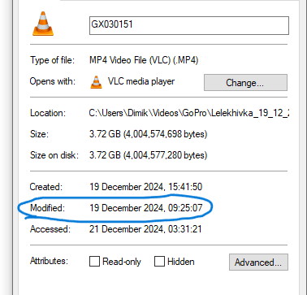
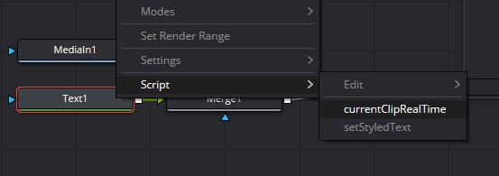
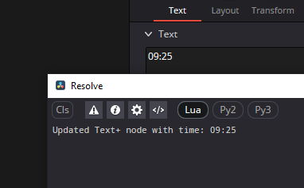

# DaVinciResolveScripts_Lua
My script to simplify or extend DaVinci Resolve functionality. (Windows)

## CurrentClipModificationTime.lua

### This script takes a clip modification time in format hh:mm and set it to the text node.

